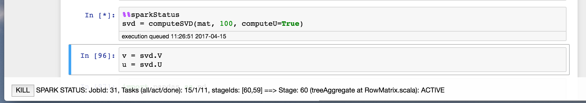

- **`%%sparkStatus`**

    Opens a little fixed bar at the bottom showing Job and Stage status
    
    Allows to kill the current job

    
    

- **`%%sql`**

    Allows to issue Spark SQL queries:
    
    `--status` same as `%%sparkStatus`
    
    `-p|--pandas <var>` store result in Pandas DataFrame
    
    `-s|--spark <var>` store result in Spark DataFrame

    `-v|--view` print results using pandas (else return Spark DataFrame)
    

- **`%%mysql`** 

    Allows to query a mySQL database
    
    `-p|--pandas <var>` store result in Pandas DataFrame
    
    Use ` mysqlConfig = dict(host="sql-host",user="me",passwd="secret",db="test") ` to configure

Examples see [Readme.ipynb](Readme.ipynb)